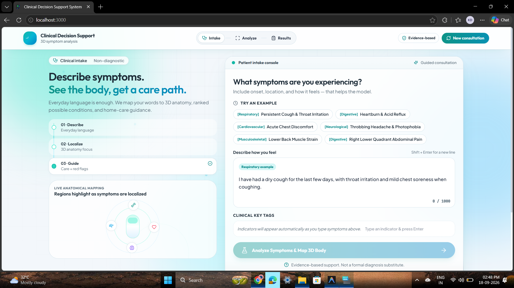
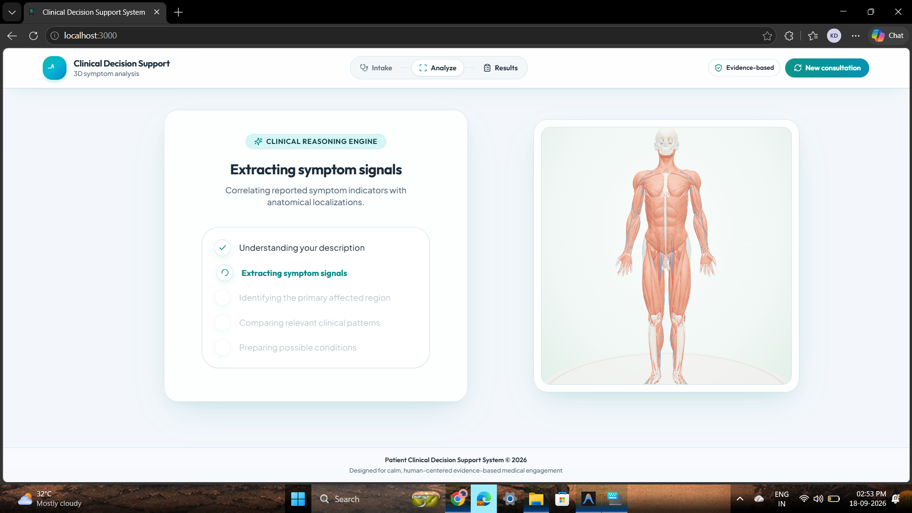
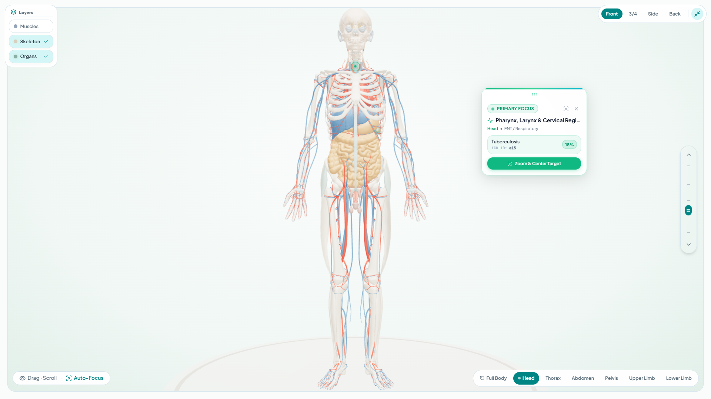
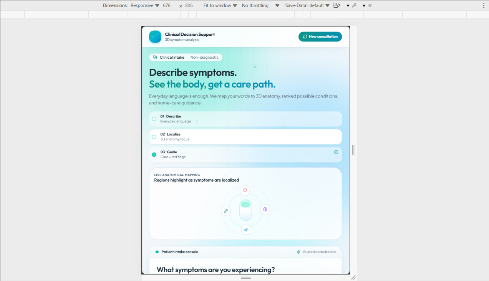

# Patient Clinical Decision Support System (CDSS)

[](https://react.dev/)
[](https://vitejs.dev/)
[](https://threejs.org/)
[](https://fastapi.tiangolo.com/)
[](https://www.python.org/)
[](https://scikit-learn.org/)
[](https://tailwindcss.com/)
[](https://www.docker.com/)
[](https://www.who.int/standards/classifications/classification-of-diseases)
[](https://opensource.org/licenses/MIT)

An evidence-based **Clinical Decision Support System (CDSS)** featuring an interactive **3D Anatomical Atlas (BodyParts3D Foundation)**, machine-learning-driven differential diagnosis across 49 pathologies, real-time physiological layer toggles, ICD-10 diagnostic localization, and structured clinical guidance for patients and healthcare practitioners.

---

<p align="center">
  
</p>

---

## 🌟 Key System Capabilities

### 1. 🧬 Interactive 3D Anatomical Atlas (BodyParts3D)
- **2,234 Anatomical Structures**: Complete reference human body model incorporating skeletal, muscular, and visceral organ assemblies.
- **GPU-Accelerated Visibility**: Zero-overhead shader uniform buffers allow instantaneous toggling between:
  - 🦴 **Skeleton** (Bones, cartilage, and connective tissues)
  - 💪 **Muscles** (Skeletal musculature & tendons)
  - 🫀 **Organs** (Cardiovascular, respiratory, digestive, nervous, urinary, endocrine, and sensory systems)
- **Clinical Region Auto-Focus**: Dynamically animates camera and illuminates affected anatomical zones (`Head`, `Thorax`, `Abdomen`, `Pelvis`, `Upper Limb`, `Lower Limb`).
- **Minimal Medical Reticle & Draggable HUD Callout**: Non-intrusive 3D target beacon with a draggable glassmorphic overlay card showing anatomical coordinates and clinical summaries without obscuring body parts.
- **Vertical Anatomy Exploration Scrollbar**: A custom interactive slider on the canvas margin enabling smooth vertical scanning from head to feet.
- **Interactive Raycasting & Tooltips**: Hover over or click any anatomical structure to view its name, physiological system, and anatomical region.

<p align="center">
  
</p>

---

### 2. 🧠 Machine Learning & Clinical NLP Engine
- **DDXPlus Benchmark Dataset**: Trained on **1,025,602 patient records** across **49 clinical pathologies** (*NeurIPS 2022 Benchmark*).
- **High-Dimensional Clinical Evidence**: Features **1,213 sparse evidence inputs** covering symptoms, exact anatomical locations, pain characteristics (burning, sharp, cramping), 1–10 severity, duration, and antecedents.
- **Verified Benchmark Accuracy**: **99.69% Top-1 Accuracy** and **99.99% Top-3 Accuracy** on 134,529 held-out test cases with full clinical evidence.
- **Free-Text Clinical NLP**: Tokenizes and extracts medical evidence from colloquial patient symptom narratives (e.g., *"stomach pain, acid reflux, mild headache"*), translating natural language into calibrated differential probability distributions.

<p align="center">
  
</p>

---

### 3. 📋 Tabbed Clinical Guidance Console
- **Conditions Tab**: Ranked differential diagnoses with match percentages, ICD-10 classification codes, clinical severity badges, and confidence dials.
- **Home Care Tab**: Evidence-based, non-pharmacological home management, hydration protocols, and lifestyle adjustments.
- **Pathophysiology Tab**: Understand *"Why It Happens"* with clear, educational explanations of the underlying anatomical and physiological mechanisms.
- **Red Flags Tab**: Urgent clinical warning signs and red-flag indicators mandating immediate emergency medical evaluation.

<p align="center">
  
</p>

---

### 4. 📱 Full Mobile & Touch Gestures Support
- **Single-Touch 360° Orbit**: Smoothly inspect anatomy from any angle.
- **Pinch-to-Zoom**: Fluid two-finger pinch gesture for granular anatomical inspection.
- **Two-Finger Pan**: Effortlessly adjust camera height and focus.
- **Adaptive Touch Sliders & Buttons**: Mobile-optimized touch targets, vertical scroll controls, and collapsible panels.

<p align="center">
  
</p>

---

## 🗺️ 6-Stage Clinical Journey

```
┌──────────────┐     ┌──────────────┐     ┌──────────────┐
│ 1. DESCRIBE  │ ──> │2. UNDERSTAND │ ──> │  3. LOCATE   │
│ Natural text │     │ NLP evidence │     │ Body system  │
│ symptom input│     │  extraction  │     │ & 3D region  │
└──────────────┘     └──────────────┘     └──────────────┘
                                                 │
┌──────────────┐     ┌──────────────┐            │
│6. VISUALIZE  │ <── │5. STANDARDIZE│ <──────────┘
│3D interactive│     │ICD-10 coding │     ┌──────────────┐
│master console│     │& triage dial │ <── │  4. EXPLORE  │
└──────────────┘     └──────────────┘     │ Differential │
                                          │ ML ranking   │
                                          └──────────────┘
```

---

## 📂 Repository Structure

```text
patient-diagnosis-system/
├── .dockerignore                  # Docker build exclusions
├── .gitignore                     # Workspace Git exclusion rules
├── docker-compose.yml             # Multi-container orchestration (Backend + Frontend)
├── LICENSE                        # MIT License
├── README.md                      # Primary project documentation
├── run_server.py                  # One-click local launcher for FastAPI backend
│
├── backend/                       # Python 3.11 + FastAPI + ML Service
│   ├── Dockerfile                 # Backend production container configuration
│   ├── README.md                  # Comprehensive backend architecture & API guide
│   ├── requirements.txt           # Python dependencies (FastAPI, Scikit-Learn, Gunicorn)
│   ├── app/                       # FastAPI application (routes, schemas, services)
│   ├── data/                      # DDXPlus clinical dataset & 3D coordinate mappings
│   └── models/                    # Trained diagnostic models, evaluation metrics & pipeline
│
├── docs/                          # Architectural, Clinical & Presentation Documents
│   ├── PPT_PRESENTATION_CONTENT.md# Complete presentation slide deck content (11 slides)
│   ├── ARCHITECTURE.md            # System design, data flow & component boundaries
│   ├── DEPLOYMENT_GUIDE.md        # Production deployment guide (Render, Vercel, Docker, VPS)
│   ├── PROJECT_CONTEXT.md         # Clinical domain scope & clinical safety guidelines
│   ├── SYSTEM_FEATURES.md         # Detailed guide to all features (3D camera, reticle, NLP)
│   └── DEVELOPMENT_PLAN.md        # Roadmap, completed milestones & verification logs
│
└── frontend/                      # React Web Application
    ├── Dockerfile                 # Frontend production container configuration (Nginx)
    ├── nginx.conf                 # Nginx SPA & reverse proxy configuration
    ├── index.html
    ├── package.json
    ├── vite.config.js
    ├── tailwind.config.js
    │
    ├── public/
    │   └── models/                # BodyParts3D dataset
    │       ├── atlas.json         # 2,234 anatomical structures manifest
    │       ├── body-*.bin / .gz   # Binary geometry chunks (positions, normals, indices)
    │       └── ATTRIBUTION.md     # CC BY 4.0 data attribution (BodyParts3D)
    │
    └── src/
        ├── App.jsx                # Clinical journey controller & responsive layout
        ├── index.css              # Editorial glassmorphism styling & theme tokens
        ├── components/            # Reusable UI widgets (Header, ScoreGauge, StatusBadge)
        ├── features/
        │   ├── symptom-input/     # Natural language symptom input & quick chips
        │   ├── analysis/          # Clinical processing pipeline visualization
        │   ├── results/           # Tabbed clinical guidance console
        │   └── body-viewer/       # Three.js 3D Anatomy engine, shaders & touch controls
        │       ├── BodyViewer.jsx # 3D Canvas, OrbitControls, raycaster, reticle beacon
        │       ├── anatomyAtlas.js# 15 anatomical systems & region classifier
        │       └── modelLoader.js # DecompressionStream binary chunk loader
        └── services/
            └── apiService.js      # Backend API client with automatic fallback
```

---

## 🚀 Quickstart & Local Setup

### Option A: Docker Compose (Full-Stack Launch)

```bash
# 1. Clone the repository
git clone https://github.com/Kartikay-Dubey/patient-clinical-decision-support-system.git
cd patient-clinical-decision-support-system

# 2. Build and start both Backend & Frontend containers
docker compose up -d --build
```
- **Web Application**: [http://localhost:3000](http://localhost:3000)
- **FastAPI Backend & Interactive Swagger API Docs**: [http://localhost:8000/docs](http://localhost:8000/docs)

---

### Option B: Local Development Setup

#### 1. Start the Backend (FastAPI + ML Engine)
```bash
# Create and activate virtual environment
python -m venv .venv
# On Windows (PowerShell):
.\.venv\Scripts\Activate.ps1
# On Linux/macOS:
source .venv/bin/activate

# Install dependencies
pip install -r backend/requirements.txt

# Run the backend server
python run_server.py
```
*Backend runs at [http://127.0.0.1:8000](http://127.0.0.1:8000).*

#### 2. Start the Frontend (React + Vite)
```bash
cd frontend
npm install
npm run dev
```
*Frontend runs at [http://localhost:3000](http://localhost:3000).*

---

## 📊 Machine Learning Model Evaluation

The supervised diagnostic classifier is trained on the official **DDXPlus** dataset using multi-class Logistic Regression with sparse multi-hot evidence vectors:

| Metric | Validation Set (132,448 cases) | Test Set (134,529 cases) |
| :--- | :---: | :---: |
| **Top-1 Diagnostic Accuracy** | **99.66%** | **99.69%** |
| **Top-3 Diagnostic Accuracy** | **100.00%** | **99.99%** |
| **Top-5 Diagnostic Accuracy** | **100.00%** | **100.00%** |
| **Macro-Precision** | 99.69% | **99.72%** |
| **Macro-Recall** | 99.41% | **99.59%** |
| **Macro-F1 Score** | 99.53% | **99.65%** |
| **Weighted F1 Score** | 99.66% | **99.69%** |

> *Full evaluation breakdown, confusion matrices, and benchmark details are documented in [`backend/models/MODEL_REPORT.md`](backend/models/MODEL_REPORT.md) and [`docs/PPT_PRESENTATION_CONTENT.md`](docs/PPT_PRESENTATION_CONTENT.md).*

---

## 📖 In-Depth Documentation Links

- 📊 [**Presentation Content Guide (PPT)**](docs/PPT_PRESENTATION_CONTENT.md) — 11-slide complete presentation script with problem statement, architecture, ML metrics, and references.
- 🚀 [**Production Deployment Guide**](docs/DEPLOYMENT_GUIDE.md) — Step-by-step instructions for Render (backend), Vercel (frontend), Docker, and VPS Nginx deployment.
- 🩺 [**System Features & Interaction Guide**](docs/SYSTEM_FEATURES.md) — Guide to 3D camera controls, beacon reticle, draggable HUD card, vertical scrollbar, and layer isolation.
- ⚙️ [**Backend Architecture & API Specs**](backend/README.md) — REST endpoints, Pydantic schemas, and NLP evidence mapping.

---

## 📜 Attribution & License

- **Anatomical Geometry**: Adapted from **BodyParts3D**, © The Database Center for Life Science (DBCLS), licensed under [CC Attribution 4.0 International (CC BY 4.0)](https://creativecommons.org/licenses/by/4.0/). See [`frontend/public/models/ATTRIBUTION.md`](frontend/public/models/ATTRIBUTION.md) for full citation.
- **DDXPlus Dataset**: © 2022 Mila / Université de Montréal / Dialogue Health Technologies (*NeurIPS 2022*).
- **Source Code**: Released under the [MIT License](LICENSE).

---

## ⚕️ Medical Disclaimer

> [!WARNING]
> This application is an educational clinical decision-support demonstration and is **not** a certified medical diagnostic device. It does not provide definitive medical diagnoses or replace direct consultation with licensed healthcare professionals. Always seek the advice of a qualified physician for any medical symptoms or emergency conditions.
